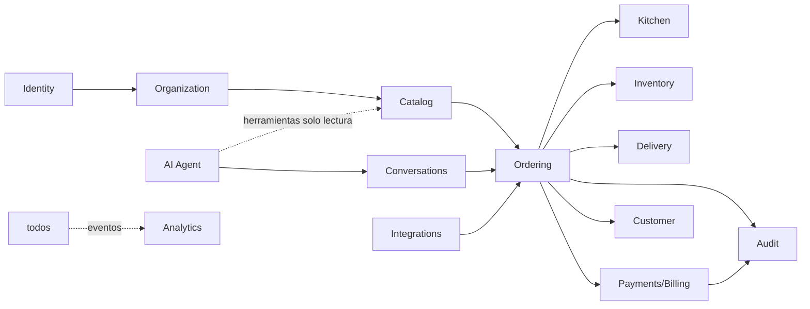

# Modelo de dominio

Contextos delimitados y sus relaciones. Detalle de entidades en cada spec de módulo.

## Decisiones estructurales (obligatorias)
1. **Marca ⟷ Cocina es M:N** (`brand_kitchen`). Nunca anidar marca dentro de local.
2. **Pedido = snapshot inmutable** de datos comerciales al confirmar (RN-T02).
3. **Consumo de stock a nivel cocina/almacén; costo atribuido a nivel marca** vía receta del producto vendido.
4. **Identificadores:** PK interna ULID; `external_ref` por canal con unique `(tenant_id, channel, external_id)`; IDs públicos opacos.
5. **Agregados con consistencia fuerte:** Pedido (con sus líneas), SesiónDeCaja, MovimientoDeStock por transacción. **Eventualmente consistente:** proyecciones de analítica, contadores, disponibilidad propagada a canales.
6. Toda entidad de negocio: `tenant_id`, `created_at`, `updated_at`, versión optimista (`row_version`) donde hay edición concurrente (catálogo, pedidos).
