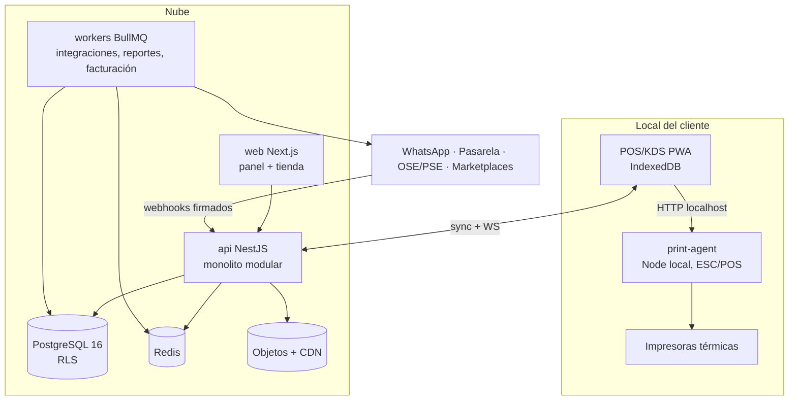

# Arquitectura

Monolito modular (ADR-0001) en NestJS (ADR-0006), bus de eventos interno con outbox/inbox (ADR-0007), PostgreSQL con RLS (ADR-0002), PWA offline con agente local de impresión (ADR-0008).

## Vista de contenedores (C4-2)

## Reglas de módulos
- API pública por módulo en `index.ts`; internals privados. `dependency-cruiser` en CI.
- Prohibido leer tablas de otro módulo. Comunicación: interfaz pública (síncrona, mismo proceso) o evento (asíncrona).
- Esquema de tablas con prefijo por módulo (`ord_`, `cat_`, `inv_`...).
- El **orquestador es el único** que crea/transiciona pedidos. El POS también entra por su interfaz.

## Camino de extracción (solo con medición, ADR nuevo)
1º ingestor de integraciones → 2º gateway de tiempo real → 3º analítica (ya nace separada en F8). El dominio no se extrae.

## Anti-corruption layer
Cada conector externo (marketplace, pasarela, OSE, WhatsApp) traduce a contratos internos en `packages/contracts`. El dominio nunca ve payloads de proveedor.
