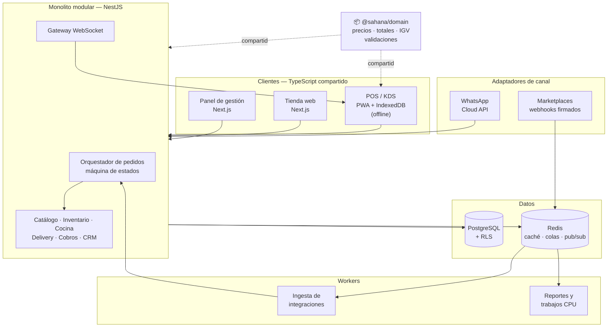

# ADR-0006 — Stack tecnológico de Sahana Food

| Campo | Valor |
|---|---|
| Estado | **Aceptado** — DP-01 resuelto: la Fase 3 se ejecuta en TypeScript/NestJS (ver nota de resolución al final) |
| Fecha | 5 de agosto de 2026 |
| Decide | Backend, frontend, cliente offline, base de datos, colas y tiempo real |
| Reemplaza a | La recomendación preliminar de Laravel del Documento maestro Fase 0, capítulo 12.3 |
| Depende de | ADR-0001 (monolito modular), ADR-0002 (multi-tenant con RLS) |
| Revisar si | Cambia la composición del equipo, o si la medición de producción contradice los supuestos de carga |

---

## 1. Contexto

El Documento maestro de Fase 0 recomendó Laravel apoyándose en un solo argumento: la disponibilidad de talento PHP en el mercado peruano. Ese argumento es real pero insuficiente, y se formuló bajo el supuesto de que el equipo de desarrollo ya estaba definido. Al quedar abierta la elección, corresponde decidir por criterios de arquitectura y no por conveniencia de contratación.

### 1.1 Corrección de una premisa

El encargo plantea preferir «una tecnología asíncrona». Conviene precisar por qué eso importa aquí, porque el motivo habitual no aplica.

El argumento estándar a favor de un runtime asíncrono es el rendimiento bajo carga de entrada/salida. Ese argumento es débil en nuestro caso: PHP con FPM, Python con workers sincrónicos o Java con hilos absorben perfectamente el volumen de webhooks que va a recibir Sahana Food en sus primeros años, simplemente escalando procesos. No vamos a recibir cien mil pedidos por segundo. Elegir por «asíncrono es más rápido» sería optimizar un problema que no tenemos.

Los dos argumentos que sí son decisivos son otros:

**Conexiones persistentes.** El KDS, el seguimiento del pedido y el panel de operación necesitan mantener miles de conexiones WebSocket abiertas simultáneamente durante todo el turno. Un modelo de proceso por petición desperdicia un proceso completo por conexión inactiva. Un runtime con bucle de eventos mantiene esas conexiones a costo marginal. Esto no es una optimización prematura: es el modo de funcionamiento normal del producto durante ocho horas al día.

**Un solo lenguaje entre servidor y cliente offline.** El POS debe seguir operando sin internet. Eso significa que el cálculo de totales, impuestos, descuentos, modificadores y combos ocurre **dos veces**: una en el cliente offline y otra en el servidor al sincronizar. Si esas dos implementaciones están en lenguajes distintos, divergen. No es una hipótesis: es lo que pasa siempre. Un total calculado distinto en el POS y en el servidor produce comprobantes electrónicos incorrectos, que en Perú es un problema tributario, no un bug.

Ese segundo punto es el que realmente decide el ADR.

### 1.2 Perfil de carga real del sistema

| Componente | Naturaleza | Peso en el código | Peso en el riesgo |
|---|---|---|---|
| Backoffice (catálogo, inventario, compras, personal) | CRUD transaccional | Alto (~55%) | Bajo |
| Orquestador de pedidos | Transaccional con consistencia fuerte | Medio (~15%) | **Crítico** |
| Ingesta de integraciones (webhooks) | E/S concurrente, tolerante a latencia | Bajo (~10%) | Alto |
| Tiempo real (KDS, tracking) | Conexiones persistentes | Bajo (~10%) | Alto |
| Analítica y reportes | CPU y consultas pesadas | Medio (~10%) | Medio |

La lectura importante: la mayor parte del código es backoffice aburrido, donde casi cualquier framework maduro sirve. La decisión debe tomarse por las tres piezas de alto riesgo, no por el volumen.

---

## 2. Alternativas consideradas

Se evaluaron seis opciones. Las tres primeras se analizaron a fondo; las tres últimas se descartaron temprano con justificación.

### 2.1 Comparación de las candidatas reales

| Criterio | NestJS (TypeScript) | Laravel (PHP) | FastAPI (Python) |
|---|---|---|---|
| Conexiones persistentes | Nativo, con adaptador Redis para escalar horizontal | Requiere Reverb u Octane; runtime adicional que operar | Nativo con ASGI |
| Lenguaje compartido con el POS offline | **Sí** — misma lógica de cálculo en servidor y PWA | No | No |
| Productividad en backoffice CRUD | Media-alta | **Muy alta** — el ecosistema más productivo de los tres | Media |
| Estructura para monolito modular | **Excelente** — módulos con dependencias explícitas, verificables estáticamente | Buena, pero las fronteras dependen de disciplina | Requiere convención propia; el framework no opina |
| Manejo de dinero | Riesgoso por defecto (punto flotante); exige disciplina explícita | Seguro con casts a decimal | Seguro con `Decimal` |
| Transacciones y ORM | Buena, con control explícito de conexión | **Excelente** (Eloquent) | Excelente (SQLAlchemy 2) |
| Compatibilidad con RLS de PostgreSQL | Buena con Drizzle (control directo de la conexión) | Requiere trabajo manual sobre el pool | Buena con SQLAlchemy |
| Colas y trabajos en segundo plano | BullMQ sobre Redis, maduro | Nativo, el mejor de los tres | Celery o ARQ, correcto |
| Ecosistema de analítica y pronóstico | Pobre | Pobre | **Excelente** |
| Talento senior en Lima | Medio | **Alto** | Medio-bajo |
| Costo de mantenimiento | Medio | Bajo | Medio |

### 2.2 Descartadas

**Django.** Es el equivalente a Laravel en el mundo Python y comparte sus virtudes de productividad, pero su soporte asíncrono sigue siendo parcial y su ORM no está pensado para el modelo de conexión que exige RLS por petición. No aporta nada que Laravel o FastAPI no den mejor.

**Spring Boot.** Técnicamente irreprochable y probablemente la opción más robusta a diez años. Descartada por costo: la verbosidad y el tiempo de arranque de un equipo pequeño en Java penalizan justo la fase en que hay que iterar rápido con clientes reales. Es la elección correcta para un producto financiado y con equipo grande, no para este.

**.NET.** Mismo razonamiento que Spring Boot, agravado por una densidad de talento aún menor en el mercado peruano para productos SaaS de este perfil.

---

## 3. Decisión

**Se adopta TypeScript sobre Node.js, con NestJS como framework de backend, para todo el sistema transaccional. Se reserva Python exclusivamente para el servicio de analítica y pronóstico, y no antes de la Fase 8.**

### 3.1 Stack completo

| Capa | Elección | Justificación breve |
|---|---|---|
| Lenguaje de dominio | TypeScript (modo estricto) | Compartido entre servidor, POS offline, KDS y tienda |
| Backend | NestJS | Sistema de módulos que materializa los bounded contexts del ADR-0001 |
| ORM / acceso a datos | Drizzle ORM | Control directo de la conexión, indispensable para `SET LOCAL` de RLS; sin motor de consultas intermedio |
| Base de datos | PostgreSQL 16+ con Row Level Security | Decidido en ADR-0002 |
| Caché y coordinación | Redis | Caché de catálogo, bloqueos distribuidos, adaptador de WebSockets |
| Colas | BullMQ sobre Redis | Suficiente hasta volumen medio; migración a RabbitMQ documentada como disparador |
| Tiempo real | WebSockets nativos de Nest con adaptador Redis | Sin runtime adicional que operar |
| Panel web y tienda | Next.js (React) | Tipos compartidos con el backend; renderizado en servidor para SEO de la tienda |
| POS y KDS | **PWA en React**, no aplicación nativa | Reutiliza la lógica de dominio; instalable; funciona offline con IndexedDB |
| App de repartidor | PWA en la primera versión; React Native solo si se requiere geolocalización en segundo plano | Evita una plataforma adicional hasta tener necesidad demostrada |
| Analítica (Fase 8) | Python con FastAPI, servicio separado | Único lugar donde Python gana claramente |
| Empaquetado | Docker; sin Kubernetes | Decidido en Documento Fase 0, capítulo 12.4 |
| Observabilidad | OpenTelemetry, Prometheus, Grafana, Sentry | Estándar abierto, sin dependencia de proveedor |

### 3.2 Por qué la PWA y no una app nativa para el POS

Es la consecuencia más importante de esta decisión y merece quedar explícita. Con una PWA en TypeScript, el módulo que calcula el total de un pedido —precios por canal, modificadores, combos, promociones, IGV— es **el mismo paquete** que corre en el servidor. No hay dos implementaciones que mantener sincronizadas. Cuando cambie la regla de un combo, cambia en un solo lugar.

Con Flutter o React Native esa lógica se duplica en Dart o se comparte parcialmente con fricción. Con Laravel más Flutter se duplica siempre. Dado que el cálculo incorrecto de un total genera un comprobante electrónico incorrecto ante SUNAT, esta duplicación es la fuente de error más cara que el producto puede tener.

---

## 4. Consecuencias

### 4.1 Positivas

- Una sola base de conocimiento para todo el equipo. Con dos a cuatro personas, esto multiplica la capacidad efectiva.
- El contrato entre backend y clientes deja de ser documentación y pasa a ser código verificado en compilación. Un cambio de campo en el pedido rompe la construcción del KDS antes de llegar a producción, no en hora punta un viernes.
- Las fronteras entre módulos del monolito modular se pueden verificar automáticamente con análisis estático de dependencias, y fallar la integración continua ante una violación.
- El motor de tiempo real y el ingestor de integraciones son extraíbles después sin cambiar de lenguaje ni reescribir el dominio.

### 4.2 Negativas, y qué se hace con cada una

| Consecuencia negativa | Mitigación obligatoria |
|---|---|
| **JavaScript no tiene decimales exactos.** Sumar dinero con `number` produce errores de centavos que en un cierre de caja se convierten en un descuadre real. | Todo monto se representa como entero en unidades menores (céntimos) mediante un value object `Money`. En PostgreSQL, `NUMERIC(14,4)`. Prohibido por regla de linting el uso de `number` en cualquier campo monetario. Es el riesgo número uno de esta decisión. |
| Node es de un solo hilo por proceso: una generación de reporte pesada bloquea las peticiones de ese proceso. | Todo trabajo intensivo en CPU —reportes, PDF, procesamiento de imágenes, exportaciones— va a workers separados por cola. Nunca en el proceso que atiende peticiones. |
| Menor productividad que Laravel en el CRUD de backoffice, que es la mayor parte del código. | Generadores de código internos y un módulo base de recurso con paginación, filtros, auditoría y control de acceso resuelto una sola vez. Costo inicial de dos a tres semanas, recuperado desde el tercer módulo. |
| Talento senior de TypeScript backend es más escaso en Lima que de PHP. | La estructura opinada de NestJS reduce la dependencia de criterio senior. Aun así, la primera contratación debe ser un backend senior de Node, no un junior. |
| Nest impone menos que Laravel: hay más decisiones abiertas que pueden derivar en inconsistencia. | Documento de convenciones y plantilla de módulo aprobados **antes** de escribir el primer módulo de negocio (Fase 3). |
| Fatiga de ecosistema: el mundo Node cambia de herramientas con frecuencia. | Congelar las decisiones de este ADR por doce meses. Cualquier cambio de biblioteca central exige un nuevo ADR. |

### 4.3 Lo que esta decisión **no** cambia

Sigue vigente todo lo aprobado en el Documento maestro de Fase 0: monolito modular, aislamiento multi-tenant por RLS, marketplaces fuera del MVP, facturación delegada a OSE o PSE autorizado, y ausencia de Kubernetes. Este ADR decide con qué construir, no qué construir.

---

## 5. Arquitectura resultante

El paquete `@sahana/domain` es el corazón de la decisión: contiene las reglas de cálculo y validación, se compila una vez y se consume idéntico en el servidor y en el POS offline.

---

## 6. Disparadores de revisión

Esta decisión se reabre si ocurre alguno de estos hechos medidos, no antes:

1. El equipo que finalmente ejecuta el proyecto tiene su experiencia principal en PHP o Python y no en TypeScript. **En ese caso la decisión cambia:** la competencia real del equipo pesa más que la comparación teórica. Con un equipo PHP, se vuelve a Laravel y el POS pasa a Flutter, aceptando explícitamente la duplicación de la lógica de cálculo y documentando cómo se controlará.
2. La latencia del percentil 95 en el orquestador supera 400 ms de forma sostenida por saturación de CPU y no por consultas lentas.
3. BullMQ deja de sostener el volumen de eventos de integración con pérdida o retraso demostrado: se migra a RabbitMQ.
4. Un cliente corporativo exige residencia de datos o aislamiento dedicado que obligue a revisar ADR-0002.

---

## 7. Decisión pendiente que este ADR no resuelve

Queda una sola pregunta abierta antes de poder aprobar: **quién ejecuta el proyecto.** El punto 1 de los disparadores no es una formalidad. Si el equipo disponible es de perfil PHP, aprobar este ADR sería un error de gestión, no un acierto técnico.

La respuesta a esa pregunta es lo que convierte este documento de «Propuesto» en «Aprobado».

## 8. Resolución de DP-01 (2026-08-06)

La ejecución de la Fase 3 se realiza en **TypeScript/NestJS/Drizzle**, tal como
describe este ADR. El disparador de reversa (§6.1 → Laravel + Flutter) aplica
únicamente si el equipo humano que continúe el proyecto tiene su experiencia
principal en PHP; en ese caso, reabrir este ADR es lo correcto. Mientras el
desarrollo se realice sobre esta base de código TypeScript, la decisión queda
**aceptada** y el gate de dinero (100% de ramas en `@sahana/domain`) ya se
cumple. La representación interna de `Money` se detalla en ADR-0013.
