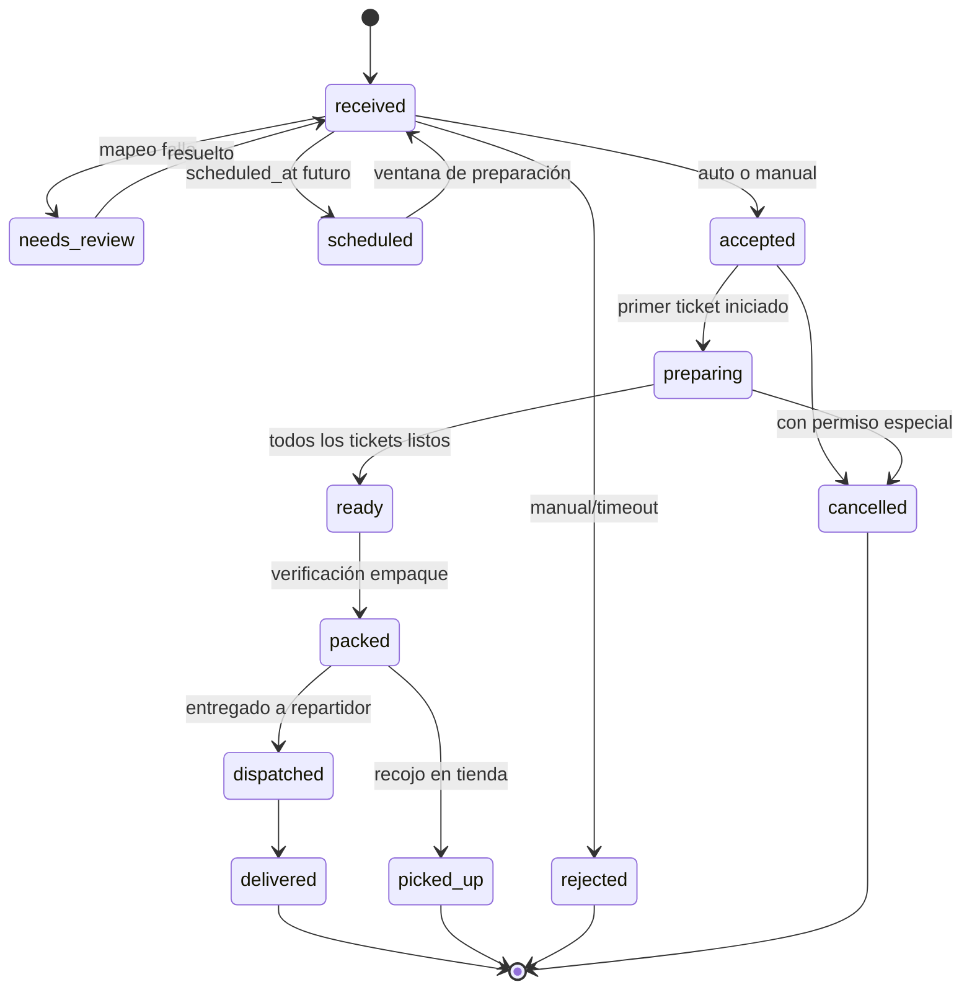

# Módulo: Ordering (Orquestador de pedidos)

> Estado: Propuesta · Fase: 4 · Depende de: Organization, Catalog, Identity · ADRs: 0001, 0007, 0010
> **Es la spec canónica: las demás siguen su nivel de detalle.**

## 1. Alcance
Único componente que crea y transiciona pedidos. Ingesta desde cualquier canal, normalización, deduplicación, validación, máquina de estados, pedidos programados, cancelaciones/modificaciones, trazabilidad completa. NO hace: cálculo de precios (delega en @sahana/domain con datos de Catalog), producción (Kitchen), cobro (Payments).

## 2. Reglas de negocio
- RN-ORD-01 Todo pedido entra por `OrderingService.submit()`; ningún módulo escribe en `ord_*` directamente.
- RN-ORD-02 Snapshot inmutable al confirmar (RN-T02): producto, precio, impuesto, comisión estimada del canal.
- RN-ORD-03 Dedupe: UNIQUE (tenant, channel, external_ref); reintento externo → misma respuesta 200 (ADR-0010).
- RN-ORD-04 Aceptación automática configurable por (canal, marca); si manual, timeout configurable (default 5 min) → alerta, y a los 10 min → auto-rechazo con notificación al canal.
- RN-ORD-05 Pedido programado entra a cocina `prep_time + margen(10 min)` antes de `scheduled_at`; hasta entonces estado `scheduled`.
- RN-ORD-06 Cancelación: antes de `preparing` → sin costo; en `preparing`+ → requiere motivo y permiso `orders.cancel_in_progress`, registra costo insumos consumidos; si facturado → dispara NC (Billing).
- RN-ORD-07 Modificación solo hasta `preparing`; genera líneas de ajuste + evento `order.modified`; nunca reescribe líneas confirmadas.
- RN-ORD-08 `promised_at` = now + tiempo estimado dinámico (input de Kitchen); recalculable hasta `accepted`, congelado después salvo saturación (evento explícito y notificación).
- RN-ORD-09 Validaciones al submit: marca activa en cocina destino, productos disponibles en (canal, local, horario), zona de cobertura si delivery, monto mínimo por zona.
- RN-ORD-10 Fallo de mapeo de catálogo externo → NO descartar: estado `needs_review` en bandeja de excepciones + alerta (nunca perder un pedido).

## 3. Entidades
`ord_orders`, `ord_order_lines`, `ord_order_events`, `ord_idempotency_keys` (ver docs/10). Invariantes: `totals` = salida de @sahana/domain (jamás recalculado en SQL); `line_total = qty*unit_price + Σmodifiers` verificado por CHECK de aplicación.

## 4. Estados y transiciones

| Transición | Precondición | Efecto | Evento |
|---|---|---|---|
| →received | válido + no duplicado | crea snapshot | order.received |
| received→accepted | RN-ORD-04/09 | congela promised_at | order.accepted |
| accepted→preparing | ticket iniciado (Kitchen) | — | (kitchen emite) |
| preparing→ready | todos kit_tickets=ready | — | order.ready |
| ready→packed | verificación OK | etiqueta impresa | order.packed |
| any→cancelled | RN-ORD-06 | reversa según estado | order.cancelled |

Transición inválida → 409 `ORDER_INVALID_TRANSITION`. Máquina definida en @sahana/domain (compartida con PWA).

## 5. Flujos
**F1 Marketplace (vía Integrations):** webhook → ack<250ms → cola → worker: dedupe → mapear catálogo (falla→needs_review) → submit → validar → aceptar (auto) → outbox(order.accepted).
**F2 Tienda con pago online:** submit con Idempotency-Key → estado received (reserva 10 min) → payment.confirmed → accepted; payment.failed/timeout → rejected(motivo=pago) + liberar.
**F3 POS offline:** PWA crea pedido ULID local estado accepted (confianza local) → sync → servidor inserta idempotente → si producto ya no existe: acepta con snapshot offline + alerta (RN-T07).
**F4 Programado:** submit(scheduled_at) → scheduled → job a t-prep → received → flujo normal con prioridad por promised_at.
**F5 Duplicado externo:** mismo (channel, external_ref) → devolver pedido existente, log dedupe_hit, NO evento nuevo.
**F6 Saturación:** kitchen.saturated → pedidos received amplían promised_at + notificación; política puede pausar canal (Catalog).

## 6. Permisos
| Acción | Roles | Ámbito |
|---|---|---|
| orders.read | todos operativos | local/marca asignados |
| orders.accept/reject | supervisor, cajero (si config) | local |
| orders.cancel | supervisor | local |
| orders.cancel_in_progress | supervisor + PIN | local |
| orders.modify | supervisor, cajero≤umbral | local |
| orders.review_exceptions | supervisor, admin | marca |

## 7. API (prefijo /api/v1)
- `POST /orders` — crea (canales propios). Headers: Idempotency-Key. Body: OrderSubmitDto (contracts). 201 / 422 validación / 422 IDEMPOTENCY_PAYLOAD_MISMATCH / 409 fuera de cobertura.
- `GET /orders?status&channel&brand_id&after&limit` — cursor.
- `GET /orders/:id` — incluye timeline (`ord_order_events`).
- `POST /orders/:id/accept | /reject | /cancel` — body {reason}. 409 transición inválida.
- `PATCH /orders/:id` — modificación (If-Match row_version). 409 versión.
- `GET /orders/exceptions` — bandeja needs_review.
- `POST /orders/:id/resolve-mapping` — body {line_fixes[]}.
Interfaz interna (no HTTP): `OrderingService.submit(NormalizedOrder)` — usada por Integrations y WhatsApp.

## 8. Eventos
Emite: order.received/accepted/rejected/modified/ready/packed/cancelled. Consume: payment.confirmed/failed, kitchen.ticket_ready, kitchen.saturated, delivery.delivered/failed. Todos vía outbox/inbox (ADR-0007).

## 9. Errores
ORDER_DUPLICATE (interno, se resuelve como 200) · ORDER_INVALID_TRANSITION · ORDER_OUT_OF_COVERAGE · ORDER_PRODUCT_UNAVAILABLE · ORDER_BELOW_MINIMUM · ORDER_MAPPING_FAILED · IDEMPOTENCY_PAYLOAD_MISMATCH.

## 10. Pruebas obligatorias
Unit: máquina de estados (toda transición válida/inválida), totales delegados (property: Σlíneas=total). Integración: dedupe concurrente (2 workers mismo external_ref → 1 pedido), idempotency-key repetida con payload igual/distinto, timeout de aceptación, programado en frontera de horario, cancelación en cada estado, needs_review→resolve. Aislamiento de tenant en TODOS los endpoints. Carga: 10× pico 15 min vía simulador sin pérdida (outbox count = pedidos).

## 11. Criterios de aceptación
1. Cero pérdida de pedidos en prueba de caos (matar worker durante ingesta): todo webhook ack'd termina en pedido o en needs_review.
2. Duplicado externo jamás crea segundo pedido (prueba concurrente).
3. Timeline completo reconstruible para cualquier pedido (runbook 1).
4. p95 submit < 500 ms con carga de referencia.
5. PWA y servidor comparten la máquina de estados (import del mismo paquete, verificado por test de simetría).

## 12. Fuera de alcance
Ruteo entre múltiples cocinas para un mismo pedido (F9). División de un pedido en varias entregas (F9).
